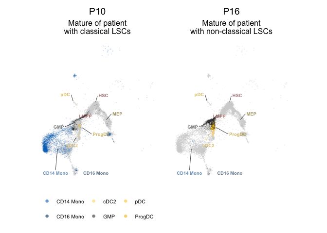
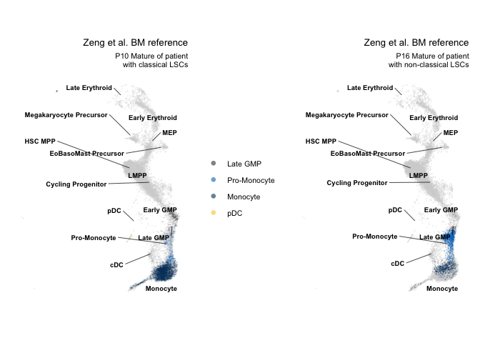
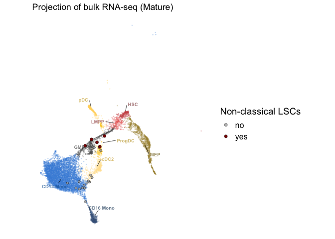

R Notebook - Figure 2 and Supplementary Figure 2
================

- [Figure 2A](#figure-2a)
- [Supplementary Figure 2A](#supplementary-figure-2a)
- [Supplementary Figure 2B](#supplementary-figure-2b)

This notebook covers plots in Figure 2 and Supplementary Figure 2.

Required packages and directories.

``` r
library(data.table)
library(dplyr)       
library(ggplot2)
library(ggpubr)
library(ggrepel)    
library(ggrastr)   
library(ggnewscale)
library(cowplot)
library(patchwork)

input_dir <- "./input/"
output_dir <- "./output/"

# Color script
source("./scripts/colors.R")
```

Read in data.

``` r
# Paired scRNA-seq data for plotting
plot_sc_paired <- fread(paste0(input_dir, 'sc_paired_df.tsv'))

# Stuart et al. healthy BM CITE-seq data
plot_stuart_sc_bm <- fread(paste0(input_dir, 'stuart_sc_bm_df.tsv'))

# Bulk projections
bulk_projections_df <- fread(paste0(input_dir, 'bulk_projections_df.tsv'))

# MATURE samples with CD64+CD11b+ cells > 40%
mature.df <- readxl::read_excel(paste0(input_dir, 'matures_to_plot.xlsx'))
```

# Figure 2A

Plot mature cells from a patient with classical LSCs and a patient with
non-classical LSCs using CITE-seq data from Stuart et al. as the BM
reference.

``` r
# Get cell type coordinates for labels
label_coord <- plot_sc_paired %>%
  group_by(predicted.celltype) %>%
  summarise(refUMAP_1 = mean(refUMAP_1),
            refUMAP_2 = mean(refUMAP_2)) %>%
  ungroup() %>%
  filter(predicted.celltype %in% myeloid.cells)

# Plot mature myeloid cells (GMP, pDC, DC, Mono) for individual patients, use all other diagnosis AML samples as background
plot.idxs <- c('P10', 'P16')

plots <- lapply(plot.idxs, function(plot.idx) {
  
  if(plot.idx == 'P10'){
   plot_subtitle <-  'Mature of patient\nwith classical LSCs'
  } else {
    plot_subtitle <-  'Mature of patient\nwith non-classical LSCs'
  }
  
  p_mature <- plot_sc_paired %>% 
  # Only focus on myeloid cells
  filter(predicted.celltype %in% myeloid.cells) %>%
  # Only focus on diagnosis samples
  filter(stage == 'Diagnosis') %>%
  # Shuffle rows
  sample_frac() %>%
  ggplot(aes(refUMAP_1, refUMAP_2)) +
  ggrastr::geom_point_rast(data = . %>% filter(!patient %in% plot.idx),
                           fill = 'lightgrey', size = 0.005, shape = 21, color = "#00000000", raster.dpi = 1000) +
  ggnewscale::new_scale_fill() +
  ggrastr::geom_point_rast(data = . %>% filter(patient %in% plot.idx & !predicted.celltype %in% mature.pop),
                           fill = 'lightgrey', size = 0.005, shape = 21, color = "#00000000", raster.dpi = 1000) +
  ggnewscale::new_scale_fill() +
  ggrastr::geom_point_rast(data = . %>% filter(patient %in% plot.idx & predicted.celltype %in% mature.pop),
                           aes(fill = predicted.celltype),
                           size = 0.05, shape = 21, color = "#00000000", raster.dpi = 1000) +
  scale_fill_manual(values = col.myeloid) +
  ggnewscale::new_scale_color() +
  # Add cell type labels
  geom_text_repel(data = label_coord,
                  aes(refUMAP_1, refUMAP_2, label = predicted.celltype, color = predicted.celltype),
                  size = 2.5,
                  fontface = 2,
                  force = 5,
                  force_pull = 0.5,
                  max.overlaps = Inf,
                  box.padding = 0.8,
                  point.padding = 0.5,
                  direction = "both", 
                  segment.color = "black",
                  segment.size = 0.25) +
  scale_color_manual(values = darken(col.myeloid, 0.2), guide = NULL) +
  theme_pubr(legend = 'bottom') + 
  theme(legend.text = element_text(size = 8),
        legend.title = element_blank(), 
        axis.text=element_text(size=12),
        axis.title=element_text(size=14),
        axis.line=element_blank(),
        axis.text.x=element_blank(),
        axis.text.y=element_blank(),
        axis.title.x=element_blank(),
        axis.title.y=element_blank(),
        axis.ticks=element_blank(),
        plot.title = element_text(hjust = 0.5),
        plot.subtitle = element_text(hjust = 0.5)
  ) +
  guides(fill = guide_legend(override.aes = list(size=2))) +
  coord_fixed() +
  labs(title = plot.idx,
       subtitle = plot_subtitle,
       x = "UMAP 1",
       y = "UMAP 2")
  
  return(p_mature)

})

p_both <- plots[[1]] +  plots[[2]] + theme(legend.position = 'none')

p_both
```

<!-- -->

``` r
save_plot(paste0(output_dir, 'Mature_classical_vs_non_classical_LSC.pdf'), p_both, ncol = 2, base_height = 5, base_width = 4)
```

# Supplementary Figure 2A

Plot mature cells from a patient with classical LSCs and a patient with
non-classical LSCs using scRNA-seq data from Zeng et al. as the BM
reference.

``` r
# Get cell type coordinates for labels
label_coord_zeng <- plot_sc_paired %>%
  group_by(predicted_CellType_Broad) %>%
  summarise(zeng_refUMAP_1 = mean(zeng_refUMAP_1),
            zeng_refUMAP_2 = mean(zeng_refUMAP_2)) %>%
  ungroup() %>%
  filter(predicted_CellType_Broad %in% myeloid.cells_zeng)

plot.idxs <- c('P10', 'P16')

plots_zeng <- lapply(plot.idxs, function(plot.idx) {
  
  if(plot.idx == 'P10'){
    plot_subtitle <-  'Mature of patient\nwith classical LSCs'
  } else {
    plot_subtitle <-  'Mature of patient\nwith non-classical LSCs'
  }
  
  p_mature_zeng <- plot_sc_paired %>% 
    # Only focus on myeloid cells that pass mapping error
    filter(predicted_CellType_Broad %in% myeloid.cells_zeng) %>%
    mutate(predicted_CellType_Broad = factor(predicted_CellType_Broad, levels = myeloid.cells_zeng)) %>%
    # Only focus on diagnosis samples
    filter(stage == 'Diagnosis') %>%
    # Shuffle rows
    sample_frac() %>%
    ggplot(aes(zeng_refUMAP_1, zeng_refUMAP_2)) + # with cell label
    ggrastr::geom_point_rast(data = . %>% filter(!patient %in% plot.idx),
                             fill = 'lightgrey', size = 0.005, shape = 21, color = "#00000000", raster.dpi = 1000) +
    ggnewscale::new_scale_fill() +
    ggrastr::geom_point_rast(data = . %>% filter(patient %in% plot.idx & !predicted_CellType_Broad %in% mature.cell_zeng),
                             fill = 'lightgrey', size = 0.005, shape = 21, color = "#00000000", raster.dpi = 1000) +
    ggnewscale::new_scale_fill() +
    ggrastr::geom_point_rast(data = . %>% filter(patient %in% plot.idx & predicted_CellType_Broad %in% mature.cell_zeng),
                             aes(fill = predicted_CellType_Broad),
                             size = 0.05, shape = 21, color = "#00000000", raster.dpi = 1000) +
    scale_fill_manual(values = col.myeloid_zeng) +
    # Add cell type labels
    geom_text_repel(data = label_coord_zeng,
                    aes(zeng_refUMAP_1, zeng_refUMAP_2, label = predicted_CellType_Broad),
                    color = 'black',
                    size = 2.5,
                    fontface = 2,
                    force = 5,
                    force_pull = 0.5,
                    max.overlaps = Inf,
                    box.padding = 0.8,
                    point.padding = 0.5,
                    direction = "both", 
                    segment.color = "black",
                    segment.size = 0.25) +
    theme_pubr(legend = 'right') + 
    theme(plot.title = element_text(hjust = 1, size = 10),
          plot.subtitle = element_text(hjust = 1, size = 8),
          legend.text = element_text(size = 8),
          legend.title = element_blank(), 
          legend.spacing.y = unit(0, "cm"),
          axis.line=element_blank(),
          axis.text.x=element_blank(),
          axis.text.y=element_blank(),
          axis.title.x=element_blank(),
          axis.title.y=element_blank(),
          axis.ticks=element_blank()
    ) +
    guides(fill = guide_legend(override.aes = list(size=2))) +
    coord_fixed() +
    labs(title = 'Zeng et al. BM reference',
         subtitle = paste(plot.idx, plot_subtitle),
         x = "UMAP 1", 
         y = "UMAP 2")
  
  return(p_mature_zeng)
})

p_both_zeng <- plots_zeng[[1]] +  plots_zeng[[2]] + theme(legend.position = 'none')

p_both_zeng
```

<!-- -->

``` r
save_plot(paste0(output_dir, 'Mature_classical_vs_non_classical_LSC_zeng_ref.pdf'), p_both_zeng, ncol = 2, base_height = 5, base_width = 4)
```

# Supplementary Figure 2B

Project non-classical LSCs onto a healthy BM reference. Plot only MATURE
samples from patients with CD64+CD11b+ cells \> 40%.

``` r
# Combine bulk projections with Stuart et al. BM
bulk_projections_stuart_sc_bm <- bind_rows(bulk_projections_df, plot_stuart_sc_bm)
  
# Get cell type coordinates for labels
label_coord <- plot_stuart_sc_bm %>%
  group_by(celltype.l2) %>%
  summarise(refUMAP_1 = mean(refUMAP_1),
            refUMAP_2 = mean(refUMAP_2)) %>%
  ungroup() %>%
  filter(celltype.l2 %in% myeloid.cells)

# Based on annotated healthy cell type
title <- 'Projection of bulk RNA-seq (Mature)'

p_monolsc <- bulk_projections_stuart_sc_bm %>% 
  filter(celltype.l2 %in% celltypes_MATURE) %>% # only bulk MATURE samples
  ggplot(aes(refUMAP_1, refUMAP_2)) +
  geom_point(data = . %>% filter(batch == "bmcite"), aes(color = celltype.l2), size = 0.2, alpha = 0.2) +
  scale_color_manual(values = lighten(col.myeloid, 0.2),
                     guide = 'none') +
  guides(color = 'none') +
  # Start a new scale
  ggnewscale::new_scale_color() +
  # Plot mature samples with mature >40%
  geom_point(data = . %>% filter(batch == "combined" & `Mono.LSCs` %in%  c('no') & Cell %in% mature.df$Sample),
             aes(fill = `Mono.LSCs`),
             size = 1.5, alpha = 0.8, stroke = 0.25, shape = 21) +
  geom_point(data = . %>% filter(batch == "combined" & `Mono.LSCs` %in%  c('yes') & Cell %in% mature.df$Sample),
             aes(fill = `Mono.LSCs`),
             size = 2, alpha = 1, stroke = 0.25, shape = 21) +
  scale_fill_manual(values = col.MonoLSC) +
  # Start a new scale
  ggnewscale::new_scale_color() +
  # Add cell type labels
  geom_text_repel(data = label_coord,
                  aes(refUMAP_1, refUMAP_2, label = celltype.l2, color = celltype.l2),
                  size = 2.5,
                  fontface = 2,
                  force = 5,
                  force_pull = 0.5,
                  max.overlaps = Inf,
                  box.padding = 0.8,
                  point.padding = 0.5,
                  direction = "both", 
                  segment.color = "black",
                  segment.size = 0.25) +
  scale_color_manual(values = darken(col.myeloid, 0.2), guide = NULL) +
  guides(fill = guide_legend(override.aes = list(shape = 21, size = 2), title = "Non-classical LSCs")) +
  ggtitle(paste(title)) +
  theme_classic() + 
  theme(legend.text = element_text(size = 12),
        legend.title = element_text(size = 14),
        axis.text=element_text(size=12),
        axis.title=element_text(size=14),
        axis.line=element_blank(),
        axis.text.x=element_blank(),
        axis.text.y=element_blank(),
        axis.title.x=element_blank(),
        axis.title.y=element_blank(),
        axis.ticks=element_blank()
  ) +
  coord_fixed() +
  labs(title = title,
       x = "UMAP 1",
       y = "UMAP 2")  

p_monolsc
```

<!-- -->

``` r
save_plot(paste0(output_dir, 'Projection_non_classical_LSCs.pdf'), p_monolsc, base_height = 5, base_width = 6)
```
