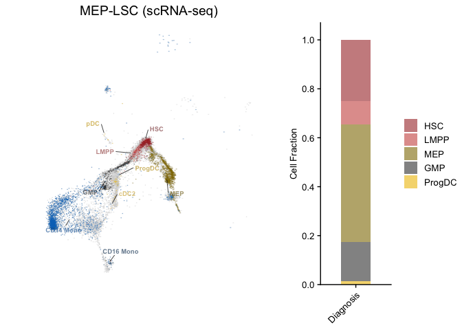
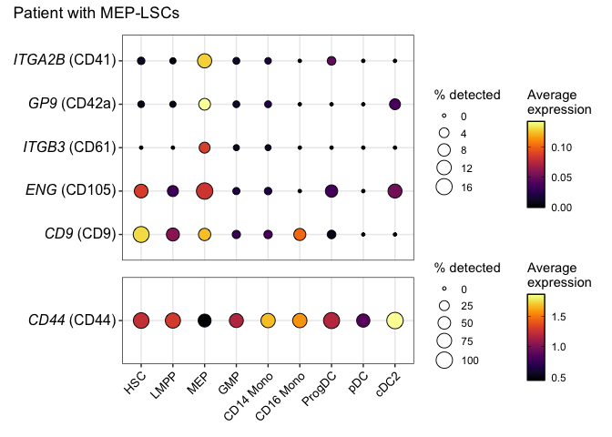
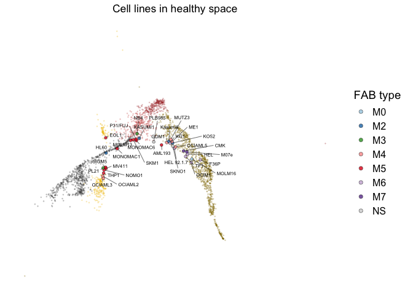

R Notebook - Supplementary Figure 6
================

- [Supplementary Figure 6A](#supplementary-figure-6a)
- [Supplementary Figure 6A](#supplementary-figure-6a-1)
- [Supplementary Figure 6F](#supplementary-figure-6f)

This notebook covers plots in Supplementary Figure 6.

Required packages and directories.

``` r
library(data.table)
library(dplyr)
library(tidyr)
library(tibble)
library(stringr)
library(ggplot2)
library(ggrepel)
library(ggrastr)
library(ggnewscale)
library(ggtext)
library(ggpubr)
library(cowplot)
library(patchwork)

input_dir <- "./input/"
output_dir <- "./output/"

# Color script
source("./scripts/colors.R")
```

Read in data.

``` r
# Paired scRNA-seq data for plotting
plot_sc_paired <- fread(paste0(input_dir, 'sc_paired_df.tsv'))

# Stuart et al. healthy BM CITE-seq data
plot_stuart_sc_bm <- fread(paste0(input_dir, 'stuart_sc_bm_df.tsv'))

# Expression of selected genes
sc_paired_gene_counts_df <- fread(paste0(input_dir, 'sc_paired_gene_counts_df.tsv'))

# Cell line projections
cell_line_projections <- fread(paste0(input_dir, 'cell_line_projections_df.tsv'))
```

# Supplementary Figure 6A

Plot myeloid cells from a patient with with MEP-LSCs using CITE-seq data
from Stuart et al. as the BM reference.

``` r
# Get cell type coordinates for labels
label_coord <- plot_stuart_sc_bm %>%
  rename(predicted.celltype = celltype.l2) %>%
  group_by(predicted.celltype) %>%
  summarise(refUMAP_1 = mean(refUMAP_1),
            refUMAP_2 = mean(refUMAP_2)) %>%
  ungroup() %>%
  filter(predicted.celltype %in% myeloid.cells)

# Plot myeloid cells, use all other diagnosis AML samples as background
plot.idx <- 'P10'
plot_title <- 'MEP-LSC (scRNA-seq)'

p_umap <- plot_sc_paired %>% 
  # Only focus on myeloid cells
  filter(predicted.celltype %in% myeloid.cells) %>%
  # Only focus on diagnosis samples
  filter(stage == 'Diagnosis') %>%
  # Shuffle rows
  sample_frac() %>%
  ggplot(aes(refUMAP_1, refUMAP_2)) +
  ggrastr::geom_point_rast(data = . %>% filter(!patient %in% plot.idx),
                           fill = 'lightgrey', size = 0.005, shape = 21, color = "#00000000", raster.dpi = 1000) +
  ggnewscale::new_scale_fill() +
  ggrastr::geom_point_rast(data = . %>% filter(patient %in% plot.idx),
                           fill = 'lightgrey', size = 0.005, shape = 21, color = "#00000000", raster.dpi = 1000) +
  ggnewscale::new_scale_fill() +
  ggrastr::geom_point_rast(data = . %>% filter(patient %in% plot.idx),
                           aes(fill = predicted.celltype),
                           size = 0.05, shape = 21, color = "#00000000", raster.dpi = 1000) +
  scale_fill_manual(values = col.myeloid) +
  ggnewscale::new_scale_color() +
  # Add cell type labels
  geom_text_repel(data = label_coord,
                  aes(refUMAP_1, refUMAP_2, label = predicted.celltype, color = predicted.celltype),
                  size = 2.5,
                  fontface = 2,
                  force = 5,
                  force_pull = 0.5,
                  max.overlaps = Inf,
                  box.padding = 0.8,
                  point.padding = 0.5,
                  direction = "both", 
                  segment.color = "black",
                  segment.size = 0.25) +
  scale_color_manual(values = darken(col.myeloid, 0.2), guide = NULL) +
  labs(title = plot_title,
       x = "UMAP 1",
       y = "UMAP 2") +
  theme_pubr(legend = 'bottom') + 
  theme(legend.position = 'none', 
        axis.text=element_text(size=12),
        axis.title=element_text(size=14),
        axis.line=element_blank(),
        axis.text.x=element_blank(),
        axis.text.y=element_blank(),
        axis.title.x=element_blank(),
        axis.title.y=element_blank(),
        axis.ticks=element_blank(),
        plot.title = element_text(hjust = 0.5),
        plot.subtitle = element_text(hjust = 0.5),
        plot.margin = margin(0, 0, 0, 0)
  ) +
  coord_fixed()

# Plot myeloid progenitor cell type fractions
b_prog <- plot_sc_paired %>%
  filter(predicted.celltype %in% cell.types.prog,
         stage == 'Diagnosis', patient == plot.idx) %>%
  mutate(predicted.celltype = factor(predicted.celltype, levels = myeloid.cells)) %>%
  group_by(patient, stage, predicted.celltype) %>%
  summarise(pct = n()) %>% 
  ungroup() %>%
  ggplot(aes(x = stage, y = pct)) + 
  geom_bar(aes(fill = predicted.celltype), position="fill", stat="identity", width=0.5) +
  scale_fill_manual(values = col.myeloid, name = NULL) +
  scale_y_continuous(breaks = seq(0, 1, 0.2), expand = expansion(add = c(0, 0.07))) +
  cowplot::theme_cowplot() +
  theme(axis.text.x=element_text(angle = 45, vjust = 1, hjust=1),
        ggh4x.facet.nestline = element_line(colour = "darkgrey"),
        strip.background = element_blank(),
        strip.text = element_text(size = 10),
        axis.text = element_text(size = 10),
        axis.title = element_text(size = 10),
        legend.text = element_text(size = 10),
        panel.spacing.x = unit(0.5, "lines"),
        plot.title = element_text(hjust = 0.5, size = 10),
        plot.margin = margin(0, 0, 0, 0)) +
  labs(x = NULL,
       y = "Cell Fraction")
```

    ## `summarise()` has grouped output by 'patient', 'stage'. You can override using
    ## the `.groups` argument.

``` r
plot_both <- p_umap + b_prog +
  plot_layout(widths = c(2, 0.5))

plot_both
```

    ## Warning in plot_theme(plot): The `ggh4x.facet.nestline` theme element is not defined in the element
    ## hierarchy.

<!-- -->

``` r
save_plot(paste0(output_dir, 'Projection_MEP_LSC_patient.pdf'), plot_both, base_height = 5, base_width = 6)
```

    ## Warning in plot_theme(plot): The `ggh4x.facet.nestline` theme element is not defined in the element
    ## hierarchy.
    ## The `ggh4x.facet.nestline` theme element is not defined in the element
    ## hierarchy.

# Supplementary Figure 6A

Plot expression of MEP markers in myeloid cells for a patient with
MEP-LSCs.

``` r
plot.idx <- 'P10'

# Genes of interest
int.gene <- c('ITGA2B','GP9','ITGB3','ENG','CD9','CD44')
int.gene.label <- c('*ITGA2B* (CD41)','*GP9* (CD42a)','*ITGB3* (CD61)','*ENG* (CD105)','*CD9* (CD9)','*CD44* (CD44)')
names(int.gene.label) <- int.gene

# calculate average expression for a gene in each cell type and the proportion of cells with non-zero expression
meta_summary <- sc_paired_gene_counts_df %>%
  # Pivot longer
  pivot_longer(cols = all_of(c(int.gene)), names_to = 'Gene', values_to = 'Expression') %>%
  # average expression for a gene in each cell type and the proportion of cells with non-zero expression
  group_by(patient, stage, predicted.celltype, Gene) %>%
  summarise(Avg = mean(Expression),
            Pct = sum(Expression > 0) / length(Expression) * 100) %>%
  ungroup() %>%
  mutate(gene_group = case_when(Gene == 'CD44' ~ 'LMPP',
                                TRUE ~ 'MEP')) %>%
  mutate(Gene = factor(Gene, levels = c(int.gene)),
         gene_group = factor(gene_group, levels = c('MEP','LMPP')),
         predicted.celltype = factor(predicted.celltype, levels = cell.types))
```

    ## `summarise()` has grouped output by 'patient', 'stage', 'predicted.celltype'.
    ## You can override using the `.groups` argument.

``` r
# Get unique gene groups in their desired order
gene_groups <- c('MEP','LMPP')
plot_title <- 'Patient with MEP-LSCs'

# Count distinct genes per group for proportional heights
row_counts <- meta_summary %>%
  filter(predicted.celltype %in% myeloid.cells,
         stage == 'Diagnosis', patient == plot.idx) %>%
  group_by(gene_group) %>%
  summarise(n_genes = n_distinct(Gene)) %>%
  deframe()

heights <- row_counts[gene_groups] + 1.5

# Helper to build one panel per gene_group
make_panel <- function(grp, is_bottom = FALSE) {
  
  df <- meta_summary %>%
    filter(predicted.celltype %in% myeloid.cells,
           stage == 'Diagnosis',
           patient == plot.idx,
           gene_group == grp)
  
  # Compute data-driven limits per panel
  pct_limits <- c(0, max(df$Pct, na.rm = TRUE))
  avg_limits  <- c(min(df$Avg, na.rm = TRUE), max(df$Avg, na.rm = TRUE))
  
  genes_in_grp  <- levels(df$Gene)
  labels_in_grp <- int.gene.label[names(int.gene.label) %in% genes_in_grp]
  
  p <- ggplot(df, aes(x = predicted.celltype, y = Gene)) +
    geom_point(aes(size = Pct, fill = Avg), color = 'black', shape = 21) +
    scale_size("% detected", 
               range  = c(1, 6),
               limits = pct_limits,                    # 0 to group max
               guide  = guide_legend(order = 1)) +
    scale_fill_gradientn(
      colours = viridisLite::inferno(100),
      limits  = avg_limits,                            # group min to max
      guide   = guide_colorbar(
        order        = 2,
        ticks.colour = "black",
        frame.colour = "black"
      ),
      name = "Average\nexpression"
    ) +
    scale_y_discrete(limits = rev, labels = labels_in_grp) +
    # scale_y_discrete(limits = rev) +
    facet_grid(gene_group ~ ., scales = 'free', space = 'free') +
    labs(x = NULL, y = NULL) +
    theme_bw() +
    theme(
      axis.text.y      = ggtext::element_markdown(size = 12, color = "black"),
      axis.title       = element_text(size = 14),
      # Remove facet strip entirely
      strip.text       = element_blank(),
      strip.background = element_blank(),
      # Legends side by side per panel
      legend.position  = 'right',
      legend.box       = 'horizontal',
      legend.key.size  = unit(0.5, 'cm')
    )
  
  # Only bottom panel keeps x-axis labels
  if (!is_bottom) {
    p <- p + theme(
      axis.text.x  = element_blank(),
      axis.ticks.x = element_blank()
    )
  } else {
    p <- p + theme(
      axis.text.x = element_text(size = 10, angle = 45, hjust = 1, color = "black")
    )
  }
  
  p
}

# Build panels
panels <- lapply(seq_along(gene_groups), function(i) {
  make_panel(gene_groups[i], is_bottom = (i == length(gene_groups)))
})

# Combine with proportional heights
p_dotplot <- wrap_plots(panels, ncol = 1, heights = heights) +
  plot_annotation(
    title    = plot_title,
  )

p_dotplot
```

<!-- -->

``` r
save_plot(paste0(output_dir, 'Expression_MEP_LMPP_genes.pdf'), p_dotplot, base_height = 5, base_width = 6)
```

# Supplementary Figure 6F

Project cell line transcriptomes onto a healthy BM reference.

``` r
# Combine cell line projections with Stuart et al. BM
cell_line_projections_stuart_sc_bm <- bind_rows(cell_line_projections, plot_stuart_sc_bm)

# Keep only myeloid cell lines
cell_line_projections <- cell_line_projections %>%
  filter(Histology == 'haematopoietic_neoplasm') %>%
  filter(Hist_Subtype1 == 'acute_myeloid_leukaemia') %>%
  mutate(FAB_type = case_when(Hist_Subtype2 == 'M5a' ~ 'M5',
                              TRUE ~ Hist_Subtype2)) %>%
  mutate(FAB_type = factor(FAB_type, levels = c('M0', 'M2', 'M3', 'M4', 'M5', 'M6', 'M7', 'NS'))) %>%
  mutate(Name = str_remove_all(Name, '-'))
  
# Get cell type coordinates for labels
label_coord <- plot_stuart_sc_bm %>%
  group_by(celltype.l2) %>%
  summarise(refUMAP_1 = mean(refUMAP_1),
            refUMAP_2 = mean(refUMAP_2)) %>%
  ungroup() %>%
  filter(celltype.l2 %in% myeloid.cells)

title <- 'Cell lines in healthy space'

p_cell_lines <- plot_stuart_sc_bm %>% 
  filter(celltype.l2 %in% c(cell.types.prog)) %>%
  ggplot(aes(refUMAP_1, refUMAP_2)) + # with cell label
  geom_point(data = . %>% filter(batch == "bmcite"), aes(color = celltype.l2), size = 0.2, alpha = 0.2) +
  scale_color_manual(values = col.prog) +
  guides(color = 'none') +
  # Start a new scale
  ggnewscale::new_scale_color() +
  geom_point(data = cell_line_projections, aes(fill = FAB_type),
             size = 1.5, alpha = 0.8, stroke = 0.25, shape = 21) +
  scale_fill_manual(values = colors.FAB,
                     guide = 'FAB type') +
  ggrepel::geom_text_repel(data = cell_line_projections,
                           aes(label = Name),
                           max.overlaps = Inf, segment.size = 0.2, size = 2, min.segment.length = 0, nudge_x = 0.5) +
  guides(fill = guide_legend(override.aes = list(shape = 21, size = 2), title = "FAB type")) +
  labs(x = "UMAP 1",
       y = "UMAP 2",
       title = title) +
  theme_classic() + 
  theme(legend.text = element_text(size = 12),
        legend.title = element_text(size = 14),
        axis.text=element_text(size=12),
        axis.title=element_text(size=14),
        axis.line=element_blank(),
        axis.text.x=element_blank(),
        axis.text.y=element_blank(),
        axis.title.x=element_blank(),
        axis.title.y=element_blank(),
        axis.ticks=element_blank(),
        plot.title = element_text(hjust = 0.5)
  ) +
  coord_fixed()

p_cell_lines
```

<!-- -->

``` r
save_plot(file = paste0(output_dir, "Healthy_BM_depmap_cell_lines_annotated2.pdf"), p_cell_lines, base_height = 4, base_width = 5) 
```
